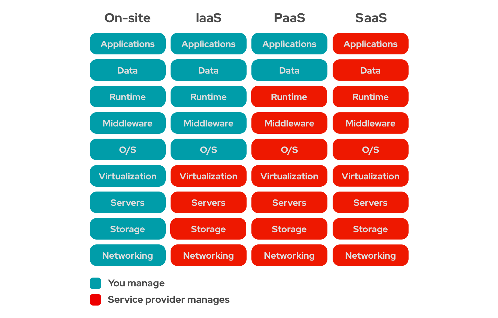
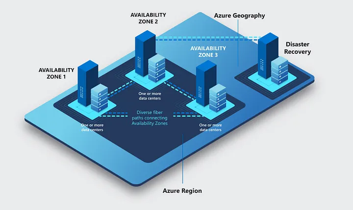

# intro to cloud

what is cloud?

cloud computing is delivery of computer service(like storage, server,database and software) over the internet.

3 major service provider

- AWS
-Azure
- GCP

4 cloud computing model

1. private cloud
2. public cloud
3. hybrid cloud
4. multi cloud

Private Cloud
Cloud infrastructure is used exclusively by one organization.
Offers more control, customization, and security, often hosted on-premises or in a private data center.

#Public Cloud
Services are offered over the internet by third-party providers (e.g., Azure, AWS).
Resources are shared among multiple tenants, making it cost-effective and scalable.

#Hybrid Cloud
Combines public and private clouds to allow data and apps to move between them.
Enables flexibility, scalability, and better compliance with sensitive workloads.

Multicloud
Uses multiple cloud providers (e.g., Azure + AWS + GCP) for different services.
Helps avoid vendor lock-in and improves resilience and availability.

# ADVANTAGES OF CLOUD:

-Cost-Effective – No upfront hardware costs; pay only for what you use.
-Scalability – Easily scale resources up or down based on demand.
-High Availability – Cloud providers offer built-in redundancy and uptime guarantees.
-Disaster Recovery – Backup and recovery solutions are easier and faster in the cloud.
-Flexibility & Mobility – Access services and data from anywhere with internet access.
-Security – Leading providers offer strong security controls, encryption, and compliance.
-Automatic Updates – Software and infrastructure updates are managed by the provider.
-Environmental Benefits – Efficient resource use reduces carbon footprint.

# DISADVANTAGE OF CLOUD: 

-Security and privacy risks
-Dependence on internet connectivity
-Potential downtime and service outages
-Limited control and flexibility
-Ongoing costs can accumulate
-Data transfer latency and bandwidth issues
    Transferring large amounts of data to/from the cloud can be slow and costly.
-Compliance and legal challenges

#TOC CALCULATOR:
Total cost ownership calculator:
A Total Cost of Ownership (TCO) calculator adds up all the costs of buying, using, and maintaining something over time.
(virtual machine, server, datacenter, network and storage.)

